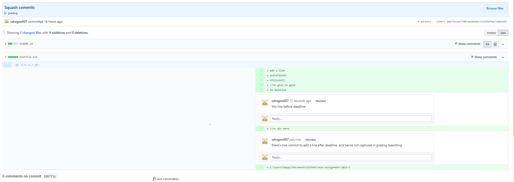

# Git Classroom Lab Guide for Student
Below will describe the simplified procedure of how to use git classroom to do lab assignments for CS1010.

# Prerequisite
* Apply for a git account and inform your lab TA
    
* Install git if you need to use it other than SoC clusters

# Userful link
* git page for cs1010 1819 sem1: https://classroom.github.com/classrooms/42259659-nus-cs1010-2018-sem1
 
* Detail walk through for git classroom: https://github.com/jfiksel/github-classroom-for-students

# Procedure to work on an assignment
* TA will send invitation link to an assignment/lab before lab, accept it and ensure a repository is cloned under the class organization for you. This repository will have all necessary instructions/skeleton codes/sample testcases, etc for corresponding assignment. 

* In your first lab session, or if you find scripts not working due to related error, insert a line "export GIT_USER=xxxx" where xxxx is your git hub account name into ~/.bashrc. Steps are:
    1. execute below command to open the file in vim
        ```sh
        vim ~/.bashrc
        ```
    2. prese i in keyboard to enable edit mode
    3. press PageDown until you are at last line. Enter to a new line
    4. Key in "export GIT_USER=xxxx" without quote and extra space
    5. Prese Esc, then enter ":x" without quote, press enter
    6. Restart unix kernel
    
* At the lab, go to your unix home directory, and run below command to download scripts for setting up of local assignment repository, and submit the work back to git:
    ```sh
    cd ~
	rm -rf ~/1819-s1-student
    git clone https://github.com/nus-cs1010/1819-s1-student.git
    ```

* Run below command to clone your assignment repository to your home directory:
    ```sh
    sh ~/1819-s1-student/Scripts/student-clone.sh
    ```

* Now you have all files for the assignments in directory of your repository name under your home directory. Start working on the problems. Do only modify/develop instruction specified files at specified location. Grading will only be performed on files at correct location
    
* When you want to submit your answer, run below command. Upon sucessful upload, you should see nothing printed out to screen after last command executed in the script which checks differences of local files and those in git repository.
    ```sh
    sh ~/1819-s1-student/Scripts/student-submit.sh
    ```

* After grading and marking is completed. Go to your git repository and navigage to "grading" branch to view comments under the only commit in that branch. 
  


